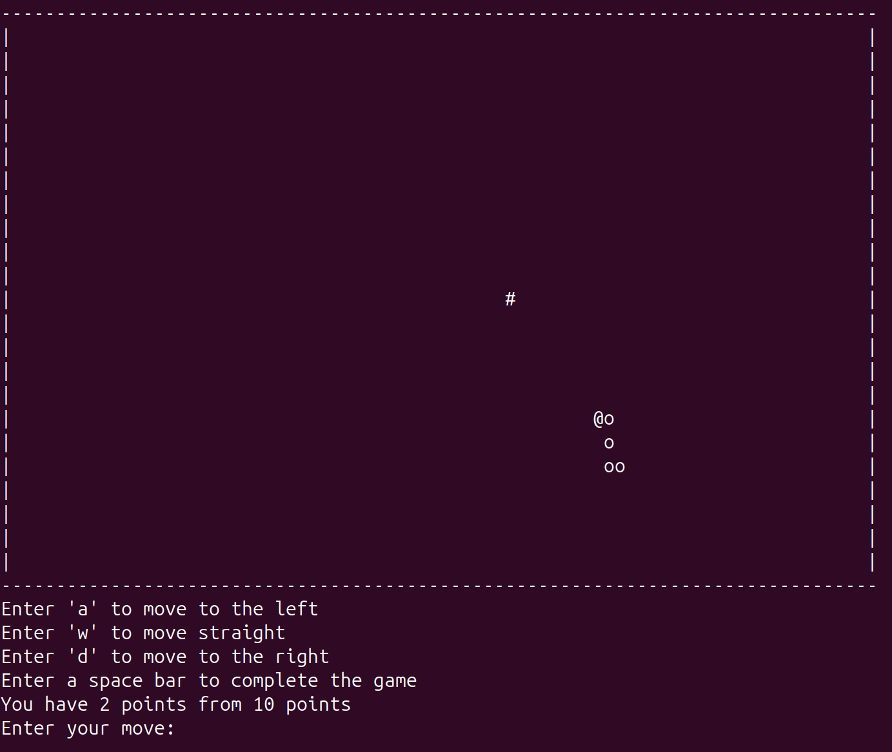
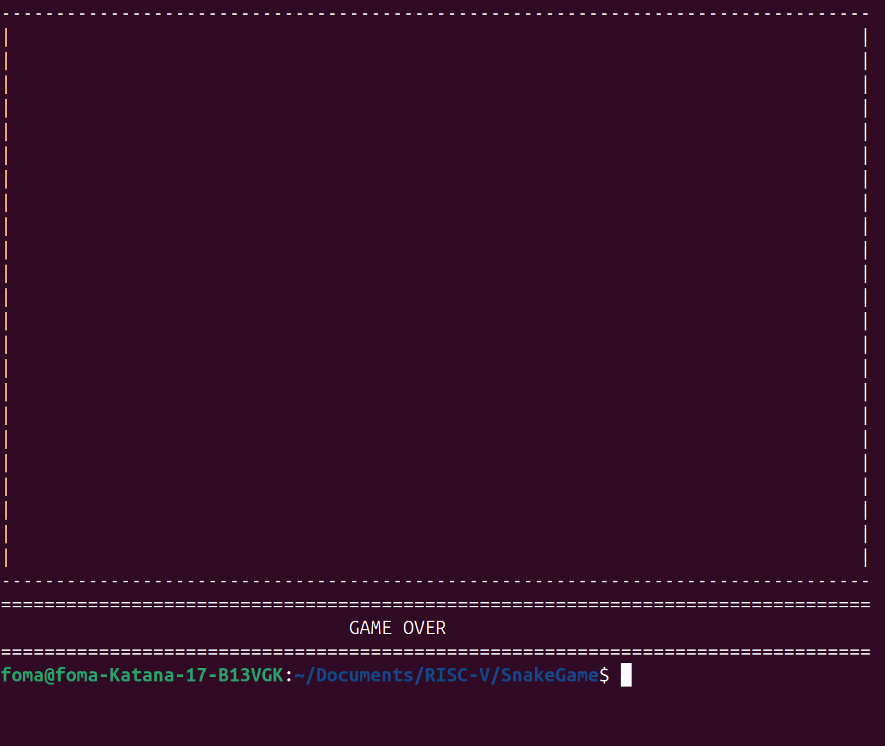
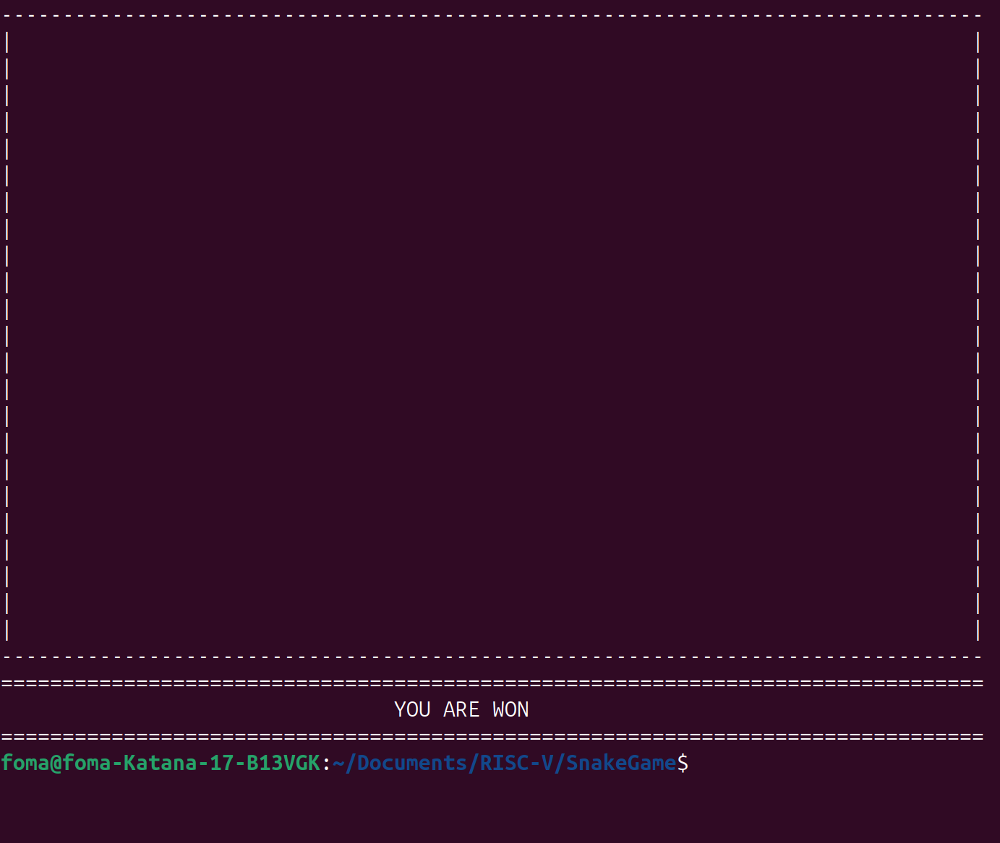
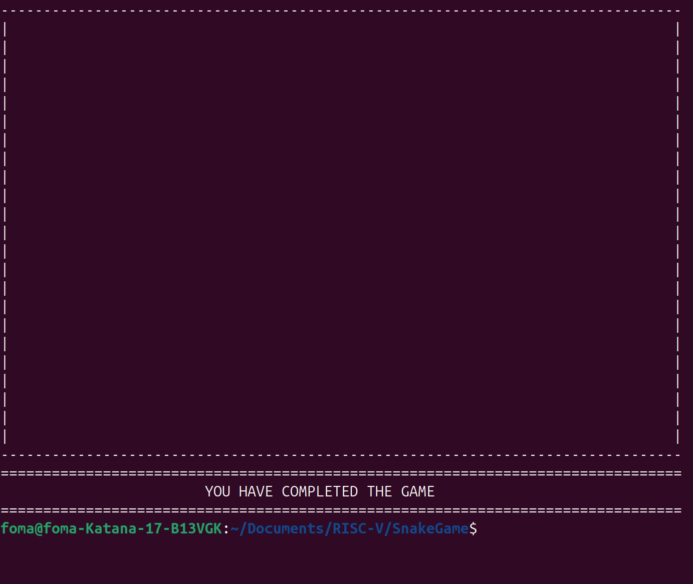

# Консольная игра "Змейка" на ассемлере RISC-V

## Введение 📝
Данный проект был написан с целью изучения программирования на языке ассемблера RISC-V.
Написание игры помогло изучить основные конструкции языка ассемблера:

* работа с регистрами
* условные переходы
* вызов стандратных Си - функций
* работа со стеком
* работа с макросами

Перед написанием проекта была прочитана книга Стивена Смита "Программирование на языке Ассемблера RISC-V"

Структура проекта:

```
├──📄main.S                             # содержит главный цикл управления программой
├──📄parse_data.S                       # макросы, отвечающие за обработку данных: считвание клавиш, перемещение объектов по полю
├──📄graphics.S                         # макросы, отвечающие за отрисовку игрового поля, змеи и яблока
├──📄debug.S                            # макросы, отвечающие за работу со стеком и вывод значений регистров (отладочная информация)
└──📄README.md
```

## Скачивание проекта 👾
1. В Вашем терминале необходимо указать директорию, куда вы хотите скачать данный проект.

2. Затем в терминале введите:
```
git clone git@github.com:SergioFoma/SnakeGame.git 
```

3. Дождитесь скачивания.

4. После чего будет создана рабочая директория с названием репозитория.

## Запуск программы 🚀

1. Для запуска необходимо перейти в папку ```SnakeGame```
```
cd SnakeGame
```

2. После этого для сборки проекта необходимо прописать команду:
```
make
```

3. Для запуска проекта необходимо запустить файл ```a.out```
```
./a.out
```

## Архитектура игры "Змейка" ⚙️
При запуске игры консоль пользователя очищается и в ней выводятся:

* Поле размером 80 * 25
* На поле отрисовывается змейка
* На поле отрисовывается яблоко (генерация случайных допустимых координат)
* Под игровым полем отображаются правила игры
* Отображается количество очков игрока (например 2 из 10)
* Идет приглаешние пользователя ввести клавишу

Змейка отрисовывается следующим образом: голова рисуется символом ```@```, а оставшиеся части тела символом ```o```.

Яблоко рисуется символом ```#```.




Игра выполняется в пошаговом режиме:

пользователь ввел клавишу, затем картинка отрисовалась

пользователь ввел клавишу, затем картинка отрисовалась

и так далее ...

## Гемплей 🎮

За управление игрой отвечают четыре клавиши:

1. a - повернуть голову налево и сдвинуться на одну клетку вперед в текущем направлении
2. w - сдвинуться на одну клетку вперед в текущем направлении
3. d - повернуть голову вправо и сдвинуться на одну клетку вперед в текущем направлении
4. spacebar - завершить игру досрочно

>❗текущее направление задает голова змейки

## Завершение игры 🏅

Завершение игры осуществляется тремя способами:

1. Соударение головы змейки с ее туловищем или стеной игрового поля.
   В таком случае игра завершается с сообщением ```GAME OVER```



2. Пользователь достигает максимального числа очков (10).
   В таком случае выводится сообщение о выигрыше ```YOU ARE WON```



3. Пользователь завершил игру досрочно, нажам клавишу ```spacebar```.
    В таком случае выводится сообщение о завершении игры ```YO HAVE COMPLETED THE GAME```


